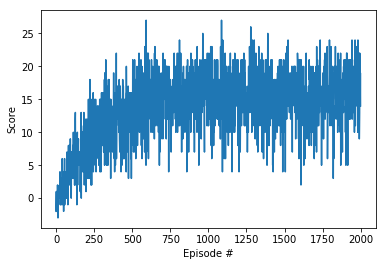

# Report
## Implementation

In this project we use Deep Q Networks to train our agent to navigate inside a Unity 3D world and collect good bananas and avoiding bad ones. The problem is considered solved if we have an average score of 13 or more over 100 episodes. The agents trained here had an average score of a little more than 16 after training for 2000 episodes.

Here we are using a Deep Q-Network in conjunction with Replay Buffer and Fixed-Q, both of which address problems in Deep Q-Networks and improve their performance.

### Deep Q-Networks
Deep Q-Networks are function approximators where you give in the current state and it gives out which action to take. Here the Deep Q-Network takes the current state as the input, which in our case is 37 followed by two hidden layers each with 64 nodes and ReLU activations, ending on the fully output layer of size 4 (number of actions).

### Fixed-Q
Since Deep Q-Networks are function approximators, while training if you update a value everything around it gets updated, this means the target value we are chasing also gets changed. We then are chasing a moving target.
To address this we keep another copy of the network which is not changed for a time period while training and use the q values from it while training. This network is also called target network since we pull out targets from this networks.

### Replay Buffer
Actions and next states are highly correlated. A set of actions may lead us to keep reaching similar states which may result in our network favouring particular set of actions which in turn may reduce the possibility of exploration.
Another situation might be where a particular state may not comeby very often and we are unable to train our network on these states.
Replay Buffer addresses this problem by saving experiences and then training our network by randomly sampling from this buffer thus breaking away from the action/next-state correlation.

## Results

Using the above techniques we solve the problem in around 600 episodes. We reach a score of a little over 26 after training for 2000 episodes. Here is the Scores vs Episodes graph of our training.

## Future Work

We can further improve this by applying Experienced Replay Buffer, Double DQN, Dueling DQN or a combination of all of the above which is also referred to as Rainbow DQN.

As a further challenge we can use raw pixels as our input and try to solve the environment.